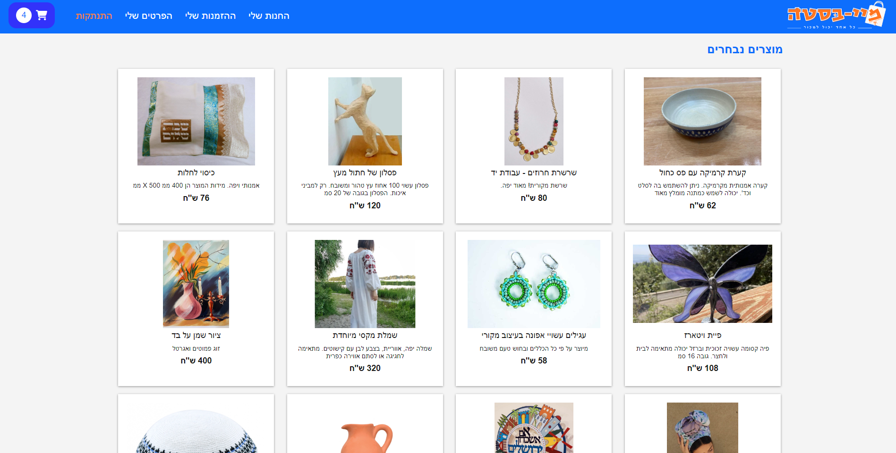
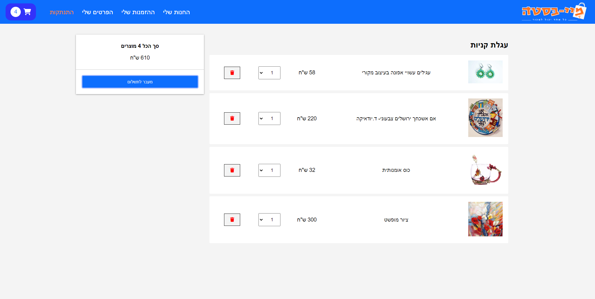

# MyBasta - Online Marketplace

MyBasta is a unique online marketplace where users can buy and sell art items, clothing, paintings, and more. The website allows registration for users and offers a personalized buying and selling experience.






## Features

- Users can view product pages without registration, but need to sign up to make purchases and sell items.
- After registration, users receive an email verification for their account.
- Once verified, users can log in and access various options.
- Option to add products to the shopping cart.
- Edit personal details and delete the account.
- Upload and sell products.
- Purchase history for users.
- Payment support through PayPal, with the option to view order history.

## Project Technologies

The project is implemented using the MERN stack:

- Frontend: Built with React and uses Redux for state management.
- Backend: Utilizes Node.js and Express.js.
- Database: MongoDB is used as the database.
- Image Management: Product images are stored on the server, and their addresses are stored in the image database.

## Responsive Design

The website is responsive and optimized for use on computers, tablets, and mobile phones, allowing users to browse the site comfortably from any device.

## Installation and Setup

Before running the project, make sure to update the necessary configuration details in the `.env` file located in the project's root directory. Follow these steps:

1. Open the `.env` file located in the project's root directory in a text editor.

2. Update the following variables with the appropriate values:

```bash
MONGO_URL = <MongoDB connection URL>
JWT_SECRET_KEY = <Secret key for JSON Web Token (JWT) encryption>
NODEMAILER_TRANSPORTER_PASS = <Password for the email transporter>
SECRET_ID = <PayPal secret ID for configuration>
CLIENT_ID = <PayPal client ID for configuration>
```

Save the changes to the `.env` file.

Now you can proceed with running the project. Follow these steps:


1. Open a terminal or command prompt in the project's root directory (MyBasta) and run the following commands:

```bash
# Install dependencies for the project's root directory
npm install

# Navigate to the frontend directory
cd frontend

# Install dependencies for the client-side (frontend) of the project
npm install

# Go back to the project's root directory
cd ../

# Navigate to the backend directory
cd backend

# Install dependencies for the server-side (backend) of the project
npm install
```   
2. With these steps completed, you are now ready to run the project. In the terminal, run the following command:

```bash
# Start the project and open the client in the browser at http://localhost:3000/
# The server will run in the background at http://localhost:3500/
npm run dev
```

   Note that the command `npm run dev` uses the `concurrently` configuration to run the client and server simultaneously.

**Note**: The website is intended for users in Israel and is displayed in Hebrew.
